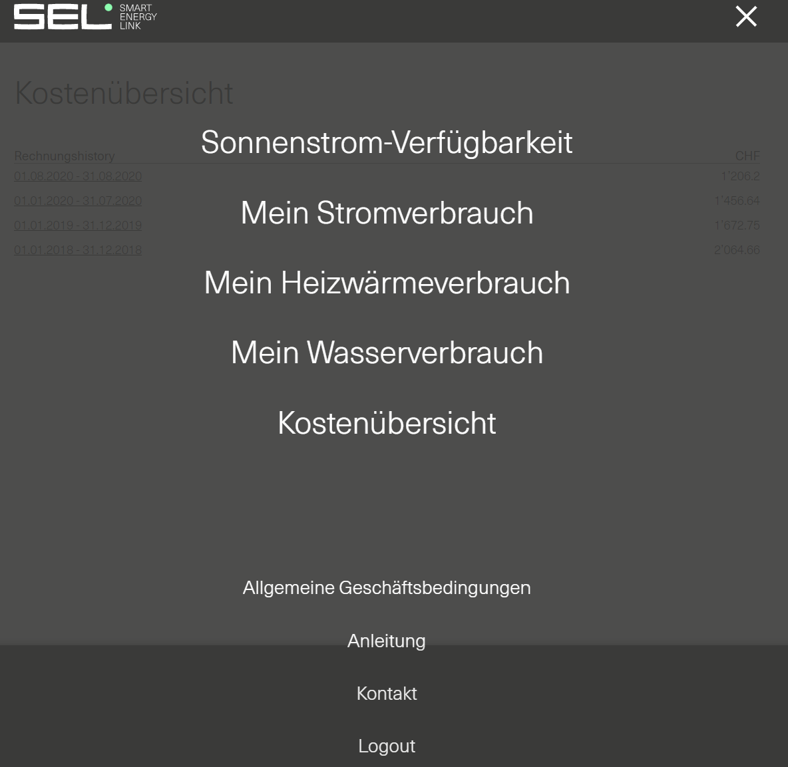
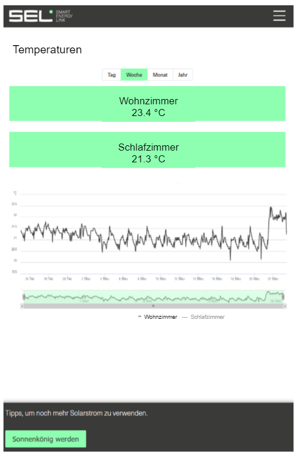

# Iteration 2

Die User-Stories für diese Iteration sind nun auf [Jira](https://smartenergylink.atlassian.net/secure/RapidBoard.jspa?rapidView=8&projectKey=PSE) (Link nur für Befugte zugänglich). Wir werden drei User-Stories implementieren und für eine weitere werden Ideen gesammelt und schliesslich ein Mockup erstellt, welches dann in der nächsten Iteration implementiert wird. 

## Beschrieb der User-Stories

- **PSE-14** 
  In der Mitgliederansicht des SEL-Portals wird ein Menüpunkt Kostenübersicht angezeigt, welcher es erlaubt den Mitgliedern einer ZEV (Zusammenschluss zum Eigenverbrauch) ihre eigenen Abrechnungen zu sehen:

  

  Es sollte nun einem Kunden möglich sein, diese Funktionalität zu unterbinden für alle Mitglieder, d.h. der Menüpunkt soll nicht mehr erreichbar sein, sowie die Rechnungen auch nicht über Link erreichbar.

- **PSE-15**
  SEL entwickelt Sensoren, von welchen einige auch Temperatur von Luft und Wasser messen. Diese Daten, welche diese Sensoren sammeln, sollen nun in einem Diagramm dargestellt werden, im gleichen Stil und mit gleicher Funktionalität, wie die anderen Diagramme auf dem Portal. Hier ein Mockup vom Endresultat:

  

  Es sollen für die verschiedenen Sensoren, die aktuelle Temeratur, sowie ein Graphen angezeigt werden, welcher die Daten eines einstellbaren Zeitbereiches darstellt.

- **PSE-16**
  Hier muss eine kleine Korrektur der Ausrichtung der Legende eines Diagramms durchgeführt werden.
- **PSE-17**
  Aktuell kann mit einem Date-Picker, mit welchem man die Zeitspanne eines Diagramms einstellen kann, nur maximal ein Jahr zurückschauen. Dies ist eine Limitation des Date-Pickers, welcher nun verbessert werden soll. Die Aufgabe der Story besteht darin, dass unser Team nun ein Design des Date-Pickers entwirft, welches anschliessend unter Absprache mit SEL in der nächsten Iteration implementiert werden sollte. Momentan ist auch duplizierzter Code dieses Date-Picker vorhanden, welcher mittels Refactoring entfernt werden sollte.

## Zuteilung

Da unser Team aus 5 Personen besteht und PSE-16 eine sehr kleine User-Story ist, werden mehrere Personen an einer User-Story arbeiten. Es gibt immer einen Hauptverantwortlichen für eine Story:

| PSE-14     | **PSE-15** |**PSE-16**|**PSE-17**|
| ---------- | --------------- | ---- | ---------- |
| Raphael Carl | Marko Cirkovic  | Severin Buchser |Severin Buchser|
| ? | ? | -    |?|

