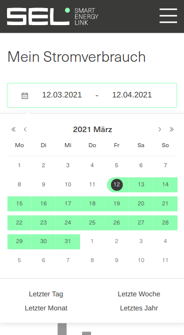
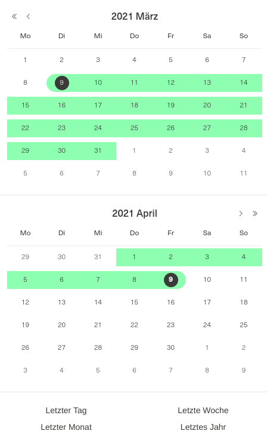
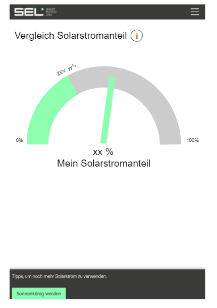

# Iteration 3

Die User-Stories für diese Iteration sind nun auf [Jira](https://smartenergylink.atlassian.net/secure/RapidBoard.jspa?rapidView=8&projectKey=PSE) (Link nur für Befugte zugänglich). Wir werden vier User-Stories implementieren.

## Beschrieb der User-Stories

- **PSE-17**
  
Die Entwicklung von PSE-17 steht nun in dieser Iteration an. Ende Iteration 2 wurden einige Vorschläge gemacht, wie der Date-Picker aussehen könnte (siehe für genauere Beschreibung [Iteration 2](https://github.com/lucaschaller/PSE-SEL-deliverables/blob/main/User-Stories%20Descriptions/Iteration%202/User-Stories%20Descriptions%20-%20Iteration%202.md)). Hier sind die zwei Mockups für PSE-17:
  
  Erster Vorschlag:
  
  

  
  Zweiter Vorschlag:
  
  

  
  Beide Vorschläge wurden von SEL in Absprache akzeptiert. Es wurde aber der erste Vorschlag schlussendlich Implementiert. Bei diesem Vorschlag wurde das Design des default Element-UI Date-Pickers verwendet und angepasst, so dass dieser responsive wird. Die Schwierigkeit bestand jedoch darin einige Funktionen zu aktivieren, welche nicht erreichbar sind, weil Element-UI keine Schnittstelle zur Verfügung stellt. Somit wurde schliesslich ein Wrapper-Component erstellt, welcher den default Element-UI Date-Picker umschliesst und schliesslich auch einen komplett neuen, responsive Date-Picker auch einschliesst. Die Wrapper-Class switcht nun zwischen den beiden Components hin und her.
  
  
  
- **PSE-18**
  
Bei den einzelnen Pages in der Mitgliederansicht besteht momentan noch kein Feature, welches das Mitglied benachrichtigt, falls dieses keine Berechtigung/keinen Zugriff auf die Daten hat. Diese Fehlermeldungen, sollten nun hinzugefügt werden. Es sind vier Fehler, welche anzeigen, ob das Mitglied keinen oder nur teilweise auf die Daten zugriff hat, oder ob keine oder nur teilweise Daten zur Verfügung stehen. Für die Implementation, kann eine bereits bestehende Request erweitert werden. Die Fehlermeldung kann dann im Frontend angezeigt werden.
  
- **PSE-19**
  Es soll in der Mitgliederansicht ein neuer Menüpunkt eingebaut werden, welcher Statistiken der gesamten Community anzeigt. Diese Menüpunkt soll bei dieser Story nur auf eine leere Seite verweisen. Der Menüpunkt heisst 'Kennzahlen'. Als Backendadministrator sollte man diesen Menüpunkt entfernen oder hinzufügen können. Diese Konfiguration findet für das gesamte ZEV statt, in welchem sich das Mitglied befindet.

- **PSE-20**
  
  Die in PSE-19 erstellte Seite soll nun die ersten Daten anzeigen. Die Daten, welche angezeigt werden sollen sind folgende: Solarstromverbrauch im Vergleich zum Netzstromverbrauch. Dies ist ein prozentualer Wert, welche durch den Gesamtstromverbrauch bestimmt wird. Schliesslich sollen die Daten wie folgt dargestellt werden:
  
  

  
  Dieser Tachometer zeigt an, wie viele Prozent des Gesamtstromverbrauch Solar- und wie viele Netzstrom ist.

## Zuteilung

Es ist der Fall, dass die Stories aus Iteration 2 noch nicht alle Fertig sind. Dies Betrifft PSE-14 und PSE-15. Diese Stories sind eigentlich soweit implementiert, es gibt aber noch Verbesserungen, welche noch Eingebaut werden müssen. Diese Verzögerung lässt und die Stories der Iteration 3 folgendermassen aufteilen: Es gibt immer einen Developer und einen Reviewer für eine Story:

|| PSE-17    | **PSE-18** |**PSE-19**|**PSE-20**|
| ---------- | ---------- | --------------- | ---- | ---------- |
|**Developer**| Severin Buchser | Marko Cirkovic  | Raphaël Carl | Luca Schaller |
|**Reviewer**| Marco Buchholz | Severin Buchser | Luca Schaller |Marco Buchholz|

