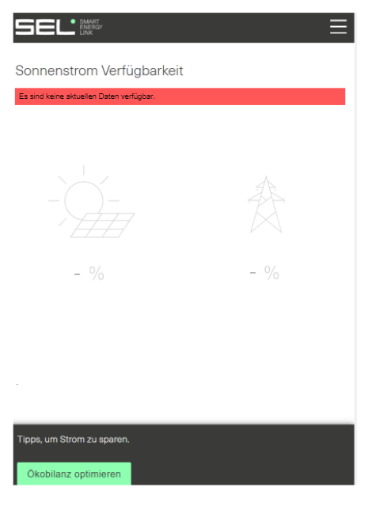
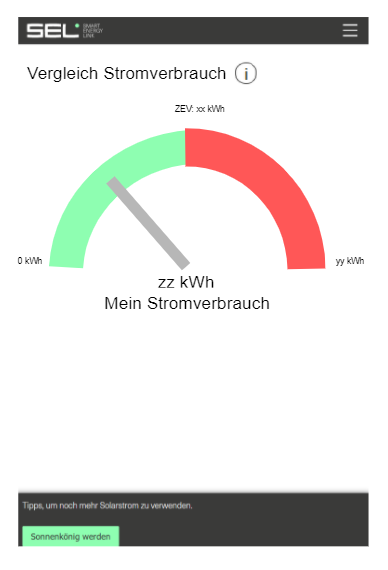

# Iteration 3

Die User-Stories für diese Iteration sind nun auf [Jira](https://smartenergylink.atlassian.net/secure/RapidBoard.jspa?rapidView=8&projectKey=PSE) (Link nur für Befugte zugänglich). Wir werden zwei User-Stories implementieren. Dies sind jedoch nur die neuen User-Stories. Alte Stories werden weiter entwickelt, da diese noch nicht abgeschlossen werden konnten.

## Beschrieb der User-Stories

- **PSE-21** 
  In der Mitgliederansicht des Kundenportals von SEL wird momentan auf der Seite 'Sonnenstrom Verfügbarkeit' die aktuelle Verfügbarkeit des Solarstroms angezeigt. Es kann jedoch sein, dass die Daten veraltet sind, wenn z.B. ein Zähler ausfällt oder die Verbindung zum Zähler nicht hergestellt werden kann. Falls dies der Fall ist, sollen neu keine Daten angezeigt werden. Falls die Daten zu alt sind, wird eine Nachricht nach folgendem Mockup angezeigt:

  

- **PSE-22**
  Die in PSE-19 erstellte Seite soll, nach dem gleichen Prinzip wie in PSE-20, weitere Daten anzeigen. Die Daten, welche angezeigt werden sollen sind folgende: Eigener Stromverbrauch im Vergleich zum durchschnittlichen Stromverbrauch im ZEV. Dies ist nicht der exakte Durchschnitt, denn um diesen zu berechnen müssten viele Abfragen gemacht werden, was zu lange dauern würde. Schliesslich sollen die Daten wie folgt dargestellt werden:

  

  Dieser Tachometer zeigt an, wie gross der eigene Stromverbrauch ist, im Vergleich zum ZEV Durchschnitt ist.

## Zuteilung

In dieser Iteration werden alle User-Stories von Severin Buchser entwickelt. Alle anderen Teammitglieder sind noch mit der Implementierung alter User-Stories beschäftigt, oder haben technische Probleme.

| PSE-21   | PSE-22 |
| ---------- | --------------- |
| Severin Buchser | Severin Buchser |
| Luca Schaller | Marco Buchholz |

